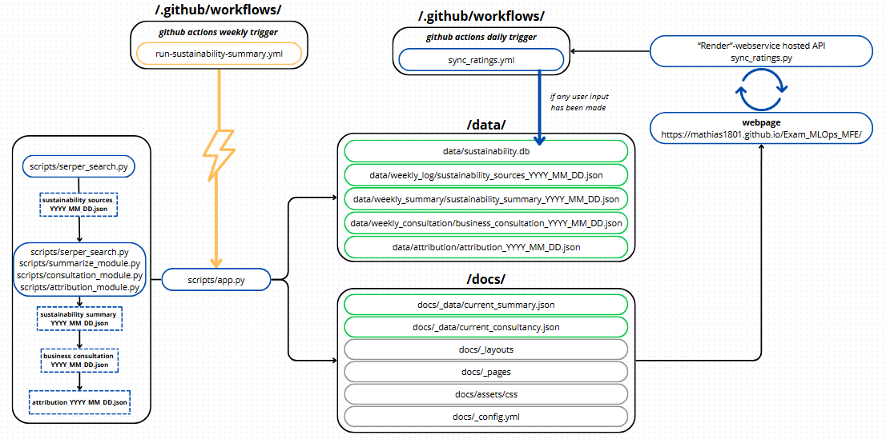

# 🌱 Sustainability Consultant

A modular system that uses LLMs and curated sustainability data to generate insightful weekly sustainability reports, business consultations, and source attribution for corporate strategy teams—tailored to companies like Maersk.

---

## 🔗 Live Application

[Explore the Live Application](https://frederikbdsstudent.github.io/Sustainability-Consultant/)

---

## ⏸️ Project Status

Live updates are currently paused. The project remains online as a portfolio snapshot, but the automated pipeline depends on external APIs, changing source coverage, and active maintenance. The latest published version is therefore being kept as a stable reference until active development resumes.

---

## 🧭 Project Overview

This project automatically:

1. **Fetches Weekly Sustainability News**
2. **Summarizes Articles using LLMs**
3. **Analyzes Strategic Business Relevance**
4. **Performs Attribution to Original Sources**
5. **Stores Data in SQLite**
6. **API-setup for User Ratings**

All components are automated and can still be run manually, but scheduled updates are currently paused.

---

## 📊 Application Flow



---

## 📂 Folder Structure

```
.
├── data/                          # Weekly JSON logs and source data
│   ├── weekly_log/
│   ├── weekly_summary/
│   ├── weekly_consultation/
│   ├── attribution/
│   └── sustainability.db         # SQLite storage
├── docs/_data/                   # Live JSON data for frontend rendering
├── render/submit_rating.py       # Render API to handle feedback and ratings
├── scripts/                      # Main automation scripts
│   ├── app.py                    # End-to-end pipeline runner
│   ├── attribution_module.py
│   ├── consultation_module.py
│   ├── summarize_module.py       
│   ├── serper_search.py       
│   └── llm_utils.py              # API wrapper
└── .github/workflows/            # GitHub Actions automation
```
---

## 🔁 GitHub Actions

Two workflows are included:
- `run-sustainability-summary.yml`: Runs the weekly pipeline manually when needed.
- `sync_ratings.yml`: Syncs ratings data manually when needed.

---

## 🧠 Tech Stack

- **LLMs**: Google Gemini 2.5
- **Render**: API for feedback
- **SQLite**: Lightweight local storage
- **GitHub Actions**: Automation
- **Python**: Core scripting and orchestration

---

## 📌 Notes

- Example company: **Maersk**
- Attribution is LLM-assisted but flags unsupported claims
- Output is saved both in JSON and SQLite for flexible use
- MVP, things might change

---
